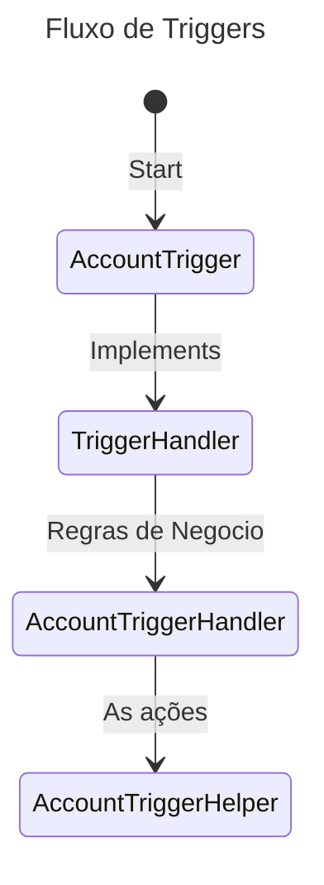
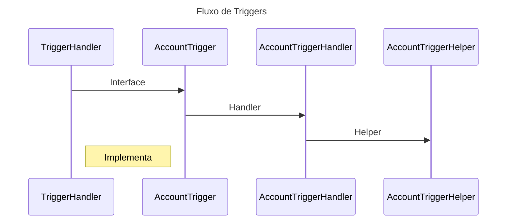

# Diagrama de State

```mermaid
---
title: Fluxo de Triggers
---
stateDiagram-v2
    AC: AccountTrigger
    TR: TriggerHandler
    ATH: AccountTriggerHandler
    HELPER: AccountTriggerHelper
    [*] --> AC: Start
    AC --> TR: Implements
    TR --> ATH: Regras de Negocio
    ATH --> HELPER: As ações
```

# Fluxo sequence

```mermaid
---
title: Fluxo de Triggers
---
sequenceDiagram
    TriggerHandler ->> AccountTrigger: Interface
    AccountTrigger ->> AccountTriggerHandler: Handler
    AccountTriggerHandler ->> AccountTriggerHelper: Helper
    Note left of AccountTrigger: Implementa
```